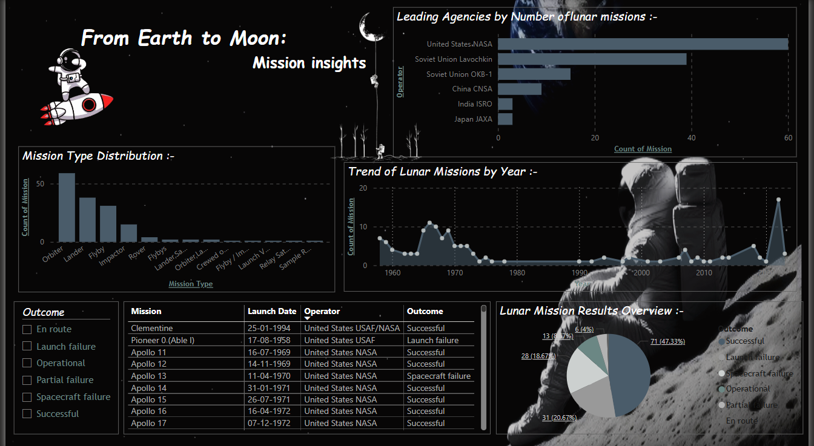

# 🌕 From Earth to Moon: Lunar Mission Dashboard

This project is a visual data dashboard providing insights into the history of lunar exploration. It covers mission types, outcomes, operator agencies, and mission trends over time.

## 📊 Dashboard Features
- Mission type distribution (Orbiter, Lander, Flyby, etc.)
- Lunar missions by top space agencies (NASA, ISRO, CNSA, etc.)
- Mission outcomes overview (success, failure, etc.)
- Trend of lunar missions over decades
- Detailed table of Apollo missions

## 📸 Preview

## 📁 Dataset
Data sourced from public archives, covering missions from 1958 to 2025.

## 🛠 Tools Used
- Power BI / MySQL
- PNG for dashboard export

## 👩‍🚀 Creator
Shivani Anil Khaire  
📫 [shivanikhaire.sk@gmail.com] -- Shivani khaire  
🌐 [GitHub Profile](https://github.com/shivanikhaire)
